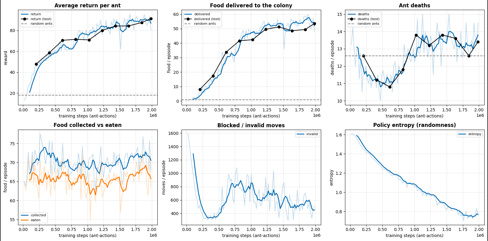
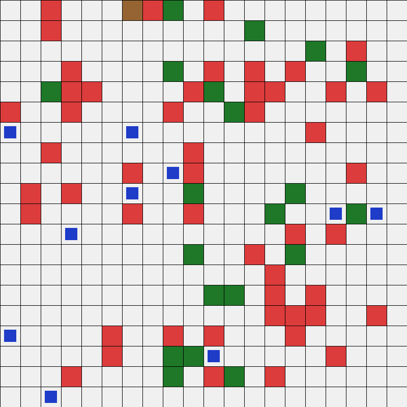

# Ant Colony PPO

A shared-policy multi-agent reinforcement learning project where 10 ants
cooperate to forage food and deliver it back to their colony. Trained with
a clean PPO implementation on a custom Gymnasium environment.

## Highlights

- **Shared policy:** all 10 ants use the same Actor-Critic network (parameter sharing).
- **Vectorized training:** 4 colonies x 10 ants = 40 parallel agents per rollout.
- **Custom Gymnasium environment** with partial observability (5x5 egocentric vision).
- **Clean PPO** with GAE(λ), clipped objective, entropy bonus, and advantage normalization.
- Trained for 2M ant-actions in ~9 minutes on CPU.

## Results

Evaluated over 10 episodes on fixed seeds, averaged across ants.

| Metric                     | Random ants | Trained policy |
|----------------------------|------------:|---------------:|
| Return per ant             |       18.1  |         39.7   |
| Food delivered per episode |        0.8  |         52.0   |
| Ant deaths per episode     |       12.6  |         14.4   |

**What works:** the policy learns to forage and deliver food reliably,
going from 0.8 to 52 food per episode. The dense energy and health shaping
also raises average return from 18.1 to 39.7.

**What doesn't:** survival. Ant deaths actually increased slightly (12.6 → 14.4).
The policy is excellent at fetching food but has not learned to stop and eat
when its energy is low. See [Lessons](#lessons).

## Project structure

    ant-colony-ppo/
    ├── src/
    │   ├── colony_env.py       # Gymnasium environment
    │   ├── ppo.py              # Actor-Critic network, RolloutBuffer, PPO update
    │   └── __init__.py
    ├── notebooks/
    │   └── colony.ipynb        # Training + evaluation notebook
    ├── checkpoints/
    │   ├── colony_ppo.pt       # Final weights
    │   └── colony_ppo_best.pt  # Best-by-eval-return weights
    ├── assets/
    │   ├── training_curves.png
    │   └── colony.gif
    ├── requirements.txt
    └── README.md

## Environment

- **Grid:** 20x20, 50 food cells, 20 tree cells.
- **Agents:** 10 ants per colony, sharing one policy.
- **Observation (per ant):** 5x5 egocentric vision with 5 channels
  (food, tree, colony, other ants, wall) flattened, plus 5 scalars
  (energy, health, inventory, signed x/y distance to colony). Total dim = 130.
- **Actions:** up, down, left, right, eat. No "stay" action. Ants must move
  every step.
- **Dynamics:** every step each ant loses 1 energy. At 0 energy, health drains
  until death. Eating food (from inventory or the colony store) restores energy.
  Dead ants respawn at a random empty cell to keep the population constant.
- **Reward shaping:** small step penalty, +2 per food collected,
  +10 per food delivered, invalid-move penalty, death penalty, plus dense
  per-step energy and health shaping.

## Quickstart

    pip install -r requirements.txt
    jupyter notebook notebooks/colony.ipynb

Run all cells to train from scratch. Training takes approximately 9 minutes
on CPU. The notebook saves the trained weights to `checkpoints/`.

To evaluate an existing checkpoint without retraining, run only the evaluation
and `watch_colony` cells at the bottom of the notebook (they load
`colony_ppo_best.pt`).

## Training setup

- 4 parallel colonies, 10 ants each → 40 agents per rollout
- 512 env steps per rollout → 20,480 transitions per update
- 4 PPO epochs, minibatch 1024, clip ε=0.2, γ=0.99, GAE λ=0.95
- Adam, lr=3e-4, entropy coef=0.001, value coef=0.5, grad clip=0.5
- Total: 2M ant-actions

## Lessons

### Reward shaping: what worked and what didn't

I ran four training configurations. Delivery saturated at ~55 episodes in all
of them, but return and behavior varied a lot:

| Config                        | Return | Delivered | Deaths | Invalid |
|-------------------------------|-------:|----------:|-------:|--------:|
| Baseline (no shaping)         |  ~55   |    ~55    |  ~12.7 |   ~700  |
| Aggressive penalties          |   ~0   |    ~55    |  ~21   |  ~2500  |
| Reverted penalties            |  ~20   |    ~55    |  ~19   |  ~2300  |
| **Dense energy/health shaping**| **~90**|   ~55    |  ~13   |   ~500  |

**Finding 1 (negative):** Heavier penalties (`step_penalty -0.05`,
`death_penalty -30`, `invalid_penalty -0.2`) made the policy worse, not
better. The per-step penalty dominates because it fires every step while the
death penalty fires once per episode. Delivery stayed constant while return
and death rate degraded.

**Finding 2 (positive):** Dense per-step energy and health shaping
(`energy_reward 0.05`, `health_reward 0.1`) with light penalties produced the
best policy by every metric except deaths. Return nearly doubled, invalid
moves dropped below the random baseline.

**Finding 3 (limitation):** Survival never improved. Clean 10-episode
evaluation shows deaths went from 12.6 (random) to 14.4 (trained). The
feedforward MLP has no memory and no explicit "nearest food" observation,
so it cannot learn the policy "if hungry and food is close, go eat; otherwise
deliver." Higher return in the fourth config reflects dense reward shaping,
not new survival behavior.

### Why invalid moves remain nonzero

Invalid moves (walking into a wall, tree, or another ant) end around 500 per
episode even after training - better than the ~700 of random ants - but not
zero. Because there is no "stay" action, ants *must* take an action every
step; when boxed in by trees and other ants, an invalid move is the only
available choice. Adding a no-op action is the obvious next step.

### What would actually improve survival

The feedforward MLP has no memory and no explicit "where is the nearest food"
feature. It cannot learn a policy like "if energy is low and food is close,
go eat; otherwise deliver." Two natural next steps:

1. **Recurrent policy** - add a GRU/LSTM over the observation history.
2. **Richer observations** - explicit (distance, direction) to nearest food,
   nearest tree, and colony, plus a "steps since last meal" scalar.

Both are significantly larger changes than a hyperparameter sweep.

